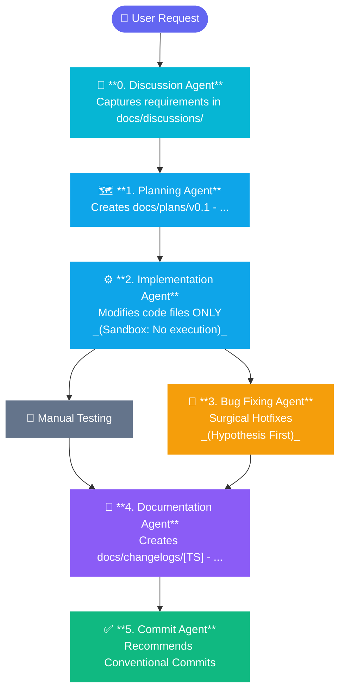

# 🤖 Agentic Assembly Line (AAL)
> A deterministic, human-in-the-loop multi-agent development pipeline — available for **Antigravity IDE**, **GitHub Copilot**, and **Claude Code**.

This repository contains a strict, modular multi-agent pipeline designed to handle software engineering tasks with high precision, absolute architectural traceability, and ironclad sandbox safety.

By separating file modification from command execution, this framework eliminates autonomous code corruption, maintains a pristine Git history, and enforces automated, chronologically sorted release tracking.

---

## 📦 Choose Your IDE

| IDE | Folder | Invocation Style | Status |
| :--- | :--- | :--- | :--- |
| 🪐 **Antigravity IDE** | [`antigravity/`](./antigravity/) | `/Planning Agent "..."` slash commands | ✅ Tested |
| 🐙 **GitHub Copilot** | [`github-copilot/`](./github-copilot/) | `@Planning Agent "..."` in Copilot Chat | ⚠️ Untested |
| 🟣 **Claude Code** | [`claude-code/`](./claude-code/) | `/planning-agent "..."` slash commands in terminal | ⚠️ Untested |

Each folder is a self-contained implementation of the same pipeline, adapted to the native agent format of its respective platform.

---

## 🛠️ The Core Agent Assembly Line

The same 7-agent pipeline is implemented across all three platforms:



| Agent | Role | Boundary |
| :--- | :--- | :--- |
| **0. .gitignore Agent** | Audits or generates a project-aware `.gitignore` offline | Read-only; never writes to `.gitignore` directly |
| **1. Discussion Agent** | Clarifies requirements and saves structured `docs/discussions/` docs | Forbidden from writing code or plan files |
| **2. Planning Agent** | Translates discussions into structured `docs/plans/` blueprints | Forbidden from altering source code |
| **3. Implementation Agent** | Writes production code based strictly on the plan | Forbidden from executing terminal commands |
| **4. Bug Fixing Agent** | Diagnoses and surgically fixes logical bugs | Forbidden from editing without explicit user approval |
| **5. Documentation Agent** | Creates timestamped changelog fragments in `docs/changelogs/` | Forbidden from altering application logic |
| **6. Commit Agent** | Recommends Conventional Commit messages | Read-only; cannot commit or push automatically |

---

## 🔄 Platform Comparison

| Feature | 🪐 Antigravity | 🐙 GitHub Copilot ⚠️ | 🟣 Claude Code ⚠️ |
| :--- | :--- | :--- | :--- |
| **Status** | ✅ Tested | ⚠️ Untested | ⚠️ Untested |
| **Agent format** | `SKILL.md` with YAML frontmatter | `.agent.md` with YAML frontmatter | `.md` slash commands |
| **Invocation** | `/Discussion Agent topic: "..."` | `@Discussion Agent topic: "..."` | `/discussion-agent "..."` |
| **File location** | `.agents/workflows/` | `github-copilot/` | `.claude/commands/` |
| **Bash access** | ❌ Sandboxed | ❌ None | ✅ Read-only only |
| **Auto timestamp** | ❌ Manual | ❌ Manual | ✅ Via `date` Bash command |
| **Tool restriction** | Via `tools:` frontmatter | Via `# tools:` frontmatter (commented) | Via `allowed-tools:` frontmatter |

> ⚠️ **Note:** The **GitHub Copilot** and **Claude Code** implementations have been authored following each platform's documented agent format but have **not yet been tested in a live project**. The agent prompts are structurally complete and ready to use — feedback and real-world validation are welcome.

---

## 📂 Recommended Project Structure

After setting up the pipeline for your chosen IDE, your project should include:

```
your-project/
├── docs/
│   ├── discussions/       ← Requirements Q&A (Discussion Agent output)
│   │   └── 20260628-1100 - feature-name.md
│   ├── plans/             ← Engineering blueprints (Planning Agent output)
│   │   └── v0.1 - feature-name.md
│   └── changelogs/        ← Timestamped release fragments (Documentation Agent output)
│       └── 20260628-1120 - v0.1 - implementation - feature-name.md
├── .env.example           ← Auto-aligned by Documentation Agent
└── src/                   ← Your application source code
```

---

## 🔒 Universal Safety Principles

Regardless of which IDE version you use, all three implementations share the same safety contract:

1. **Human-In-The-Loop Control:** Agents act as co-pilots, not pilots. Code execution and git operations are intentionally isolated to your control.
2. **Atomic Context Isolation:** Each agent is a single, focused file — keeping the AI's context window clean and eliminating hallucinations from overflowing instructions.
3. **No Code Placeholders:** Every coding-layer agent is strictly prohibited from deploying short-hands like `// TODO: implement later` to preserve production continuity.
