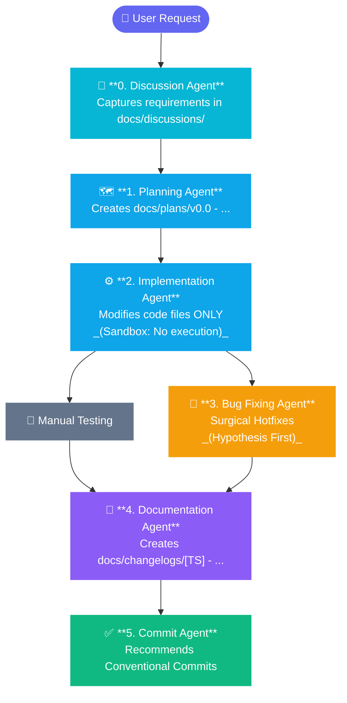

# 🤖 Agentic Assembly Line (AAL) — Claude Code Edition
> A deterministic, human-in-the-loop multi-agent development pipeline for **Claude Code** CLI.

This workspace utilizes a strict, modular multi-agent pipeline designed to handle software engineering tasks with high precision, absolute architectural traceability, and ironclad sandbox safety.

By separating file modification from command execution, this framework eliminates autonomous code corruption, maintains a pristine Git history, and enforces automated, chronologically sorted release tracking.

---

## 🛠️ The Core Agent Assembly Line

The pipeline splits responsibilities across 7 specialized, single-purpose agents:


| Agent Name | Slash Command | Agent File | Core Deliverable | Primary Boundary |
| :--- | :--- | :--- | :--- | :--- |
| **.gitignore Agent** | `/gitignore-agent` | [gitignore-agent.md](./gitignore-agent.md) | Copyable `.gitignore` block | Read-only; never writes to `.gitignore` directly |
| **Discussion Agent** | `/discussion-agent` | [discussion-agent.md](./discussion-agent.md) | `docs/discussions/[TS] - *.md` | Forbidden from writing code or plan files |
| **Planning Agent** | `/planning-agent` | [planning-agent.md](./planning-agent.md) | `docs/plans/v0.0 - *.md` | Forbidden from altering source code |
| **Implementation Agent** | `/implementation-agent` | [implementation-agent.md](./implementation-agent.md) | Functional Code Architecture | Forbidden from executing install/build commands |
| **Bug Fixing Agent** | `/bug-fixing-agent` | [bug-fixing-agent.md](./bug-fixing-agent.md) | Surgical Code Hotfixes | Forbidden from editing without explicit chat approval |
| **Documentation Agent** | `/documentation-agent` | [documentation-agent.md](./documentation-agent.md) | `docs/changelogs/[TS] - *.md` | Forbidden from altering application logic |
| **Commit Agent** | `/commit-agent` | [commit-agent.md](./commit-agent.md) | Copy-pasteable Git command | Read-only; cannot commit or push automatically |

---

## 📖 Step-by-Step Execution Guide

### 📂 Preparation: Project Directory Structure
Before running your first cycle, ensure your workspace includes these tracking directories and copy the agent command files into `.claude/commands/`:
```bash
mkdir -p docs/discussions docs/plans docs/changelogs .claude/commands
cp claude-code/*.md .claude/commands/
```

---

### 🟫 Step 0: Protect Your Repository with the .gitignore Agent

Before starting any new project or feature cycle, run the **.gitignore Agent** to ensure secrets, build artifacts, and IDE clutter are never accidentally committed.

* **How to invoke — Generate (new project):**
```text
/gitignore-agent "generate"
```

* **How to invoke — Check (existing project):**
```text
/gitignore-agent "check"
```

* **Expected Result:** The agent runs `ls -la` via Bash to detect tech stack marker files (`package.json`, `requirements.txt`, `*.xcodeproj`, etc.) and IDE artifacts (`.vscode/`, `.idea/`). It outputs a complete, ready-to-paste `.gitignore` block or an audit report of missing entries — entirely offline. You then paste the result into your `.gitignore` manually.

> 💡 The .gitignore Agent uses `ls -la` and `cat .gitignore` via Bash for workspace scanning — both are read-only and safe within Claude Code's execution model.

---

### 🟩 Step 1: Clarifying Requirements with the Discussion Agent

Before writing any plan, invoke the **Discussion Agent** with your raw feature idea. It will interview you with structured questions and produce a `docs/discussions/` document — the **token firewall** that prevents ambiguous inputs from reaching the Planning Agent.

* **How to invoke:**
```text
/discussion-agent "We need an API endpoint at /health that checks server status."
```

* **Expected Result:** The agent asks 6 clarifying questions in one message. After your answers and confirmation, it saves a structured document using `date` via Bash to `docs/discussions/[YYYYMMDD-HHMM] - [topic].md` and prints the command to pass it to the Planning Agent.

---

### 🟦 Step 2: Architecting with the Planning Agent

Once the discussion document is saved, feed it directly to the **Planning Agent** to produce a concrete implementation blueprint.

* **How to invoke:**
```text
/planning-agent "docs/discussions/20260628-1106 - health-check-endpoint.md"
```

* **Expected Result:** A new engineering blueprint is compiled under `docs/plans/vX.X - [feature description].md` broken down into *Context, Architecture, Affected Components, Steps,* and *Verification*.

---

### 🟪 Step 3: Coding with the Implementation Agent

Once the blueprint is generated, feed it directly to the **Implementation Agent**. This agent operates in a closed loop, writing production code without executing scripts.

* **How to invoke:**
```text
/implementation-agent "docs/plans/v0.1 - health check endpoint.md"
```

* **Expected Result:** The agent systematically applies the structural alterations across your source tree. If the installation of dependencies or migrations is required, it will cleanly output a code block of instructions for you to run manually.

---

### 🟨 Step 4: Resolving Quirks with the Bug Fixing Agent

If verification testing fails or an unexpected logical edge-case appears, deploy the **Bug Fixing Agent**.

* **How to invoke:**
```text
/bug-fixing-agent "The /health route is returning undefined for the environment mode, but there are no crash logs in the terminal."
```

* **Expected Protocol:** The agent will perform behavioral tracking, state its hypothesis, and output a strict *Blast Radius Assessment*. It will explicitly prompt you for approval. Type **"Go ahead"** to apply the surgical fix.

---

### 🟫 Step 5: Tracking with the Documentation Agent

With features implemented and verified, run the **Documentation Agent** to capture the historical footprint.

* **How to invoke:**
```text
/documentation-agent "docs/plans/v0.1 - health check endpoint.md"
```

*(For tracking bug hotfixes, substitute the input path with your bug trace report or file context).*
* **Expected Result:** A timestamped, separate change file is pushed to your logs directory following a strict chronological layout:
`docs/changelogs/[YYYYMMDD-HHMM] - vX.X - [implementation/patch] - [description].md`
* It will automatically align environment variations inside your root `.env.example`.

> 💡 The Documentation Agent uses `date +"%Y%m%d-%H%M"` internally via Bash (with a workspace fallback scan) to auto-generate the accurate timestamp — no manual input needed.

---

### ⬛ Step 6: Finalizing with the Commit Agent

When the workspace state is clean and documentation is synchronized, call the **Commit Agent** to lock your historical timeline down.

* **How to invoke:**
1. Stage your working changes in your terminal:
```bash
git add .
```
2. In the Claude Code chat input, trigger:
```text
/commit-agent
```

* **Expected Result:** The agent scans your file diffs and documentation timestamp fragments, outputting three clean, standardized **Conventional Commit** variants. Simply click the copy button on your preferred variant, paste it into your terminal shell, and hit enter.

---

## 🔒 Safety and Operational Principles

1. **Human-In-The-Loop Control:** Agents act as co-pilots, not pilots. Code execution and git persistence layer write operations are intentionally isolated to your control.
2. **Bash Safety Boundary:** Claude Code has native Bash access — each agent file explicitly constrains Bash usage to **read-only** operations (`grep`, `cat`, `git diff --staged`, `date`). Write and execute operations always require explicit human approval.
3. **No Code Placeholders:** Every coding layer agent is strictly prohibited from deploying short-hands like `// TODO: implement later` to preserve production continuity.
